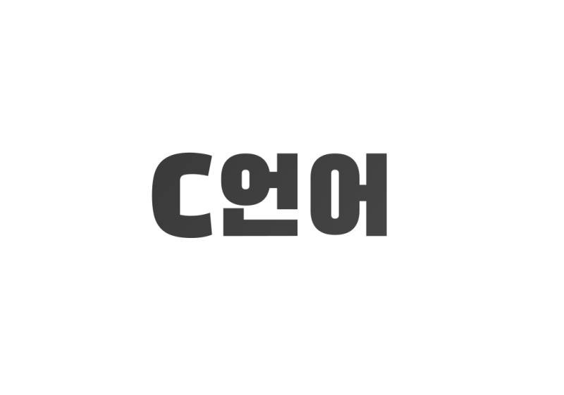

<h1>C</h1>

    

C 학습 기록 공간입니다.
C에 대해 학습한 내용을 정리하거나 새롭게 알게된 내용을 정리하고 있습니다.
 
그리고 공부한 내용을 바탕으로 작은 토이 프로젝트를 진행하면서 기록하고 있습니다.

<h2>학습 기록들 (History)</h2>

<h3>What I Learned</h3>
학습 구분 : algo, learning, nth, projects, sketch  
학습 주제 :  
[ 내용 ]  
